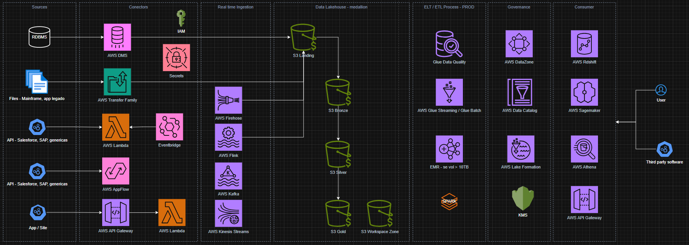

# AWS Streaming Flight Radar — Aurora + DMS

Pipeline de replicação de dados de voos do **Aurora Serverless v2 PostgreSQL** para o **S3 (Parquet)** via **AWS DMS Serverless**.

## Arquitetura



**Fluxo principal:**

1. **Aurora Serverless v2 PostgreSQL**
   - Banco relacional com schema `flight_radar` contendo tabelas dimensionais e de fatos:
     - `aircraft`, `airports`, `airlines` (dimensões)
     - `flights`, `aircraft_positions` (fatos)
   - Replicação lógica habilitada via `pglogical` para captura CDC
   - Escalabilidade automática (0.5 – 8 ACU)

2. **AWS DMS Serverless (Full Load + CDC)**
   - **Source endpoint:** Aurora PostgreSQL (via Secrets Manager para credenciais)
   - **Target endpoint:** S3 (formato Parquet, particionado por data)
   - Replicação contínua: captura inserts/updates/deletes e escreve no S3
   - Engine `pglogical` para captura de mudanças (CDC)
   - Escalabilidade automática (1 – 4 capacity units)

3. **S3 Landing Bucket**
   - Dados organizados em `dms/<db_name>/cdc/YYYYMMDD/`
   - Formato Parquet + GZip
   - Pronto para consumo por Athena/Glue/Spark

4. **Secrets Manager & KMS**
   - Credenciais do Aurora armazenadas em Secrets Manager
   - KMS gerenciado para criptografia dos dados

## Principais Componentes

- `infra/`
  - Terraform para provisionar:
    - **Aurora Serverless v2 PostgreSQL** (cluster + writer + leitores opcionais)
    - **DMS Serverless** (source endpoint Aurora, target endpoint S3, replication config)
    - Security Groups (Aurora, DMS, VPC Endpoints)
    - IAM Roles & Policies (DMS S3, DMS VPC)
    - KMS Keys (DMS)
    - VPC Endpoints (S3 Gateway, Secrets Manager Interface)
    - CloudWatch Log Groups (Aurora PostgreSQL, DMS)
- `app/seed_data/`
  - Script `generate_dms_data.py` para gerar dados de teste históricos e streaming

## Como Deployar (resumo)

1. Configurar o arquivo `.env` na raiz do projeto:

   ```bash
   # Editar .env com os valores necessários
   AWS_REGION="us-east-1"
   RDS_ADMIN_PASSWORD="<sua_senha_segura>"
   ```

2. Ajustar `infra/tfvars/terraform.tfvars` com os IDs da VPC, subnets, etc.

3. Configurar credenciais AWS (via `aws configure` ou variáveis de ambiente).

4. Executar o setup + deploy:

   ```bash
   chmod +x setup-env.sh
   ./setup-env.sh
   ```

5. Após o deploy, conectar ao banco e gerar dados de teste:

   ```bash
   cd app/seed_data
   python generate_dms_data.py all
   ```

## Verificação Rápida

```bash
# Cluster Aurora
aws rds describe-db-clusters --db-cluster-identifier flight-radar-stream-aurora

# DMS Serverless config
aws dms describe-replication-configs \
  --query "ReplicationConfigs[?contains(ReplicationConfigIdentifier, 'flight-radar-stream')]"

# Dados no S3 landing bucket
aws s3 ls s3://lakehouse-landing-<account-id>/dms/flightradar/
```

## Conexão com o banco

```bash
# Via psql (valores obtidos do setup-env.sh)
psql -h <aurora_endpoint> -p 5432 -d flightradar -U dbadmin
```

## Geração de dados de teste

O script `app/seed_data/generate_dms_data.py` oferece três modos:

```bash
# Dados históricos (12 meses de voos)
python generate_dms_data.py historical --months 12

# Streaming CDC (simula dados em tempo real)
python generate_dms_data.py stream --interval 30 --duration 300

# Histórico + streaming em sequência
python generate_dms_data.py all
```

## Segurança

- Senhas **não** são commitadas (uso de `.env` e `.gitignore`)
- Credenciais armazenadas em **AWS Secrets Manager** (KMS, audit logs)
- IAM com princípio de **least privilege**
- Security Groups com acesso restrito entre DMS e Aurora